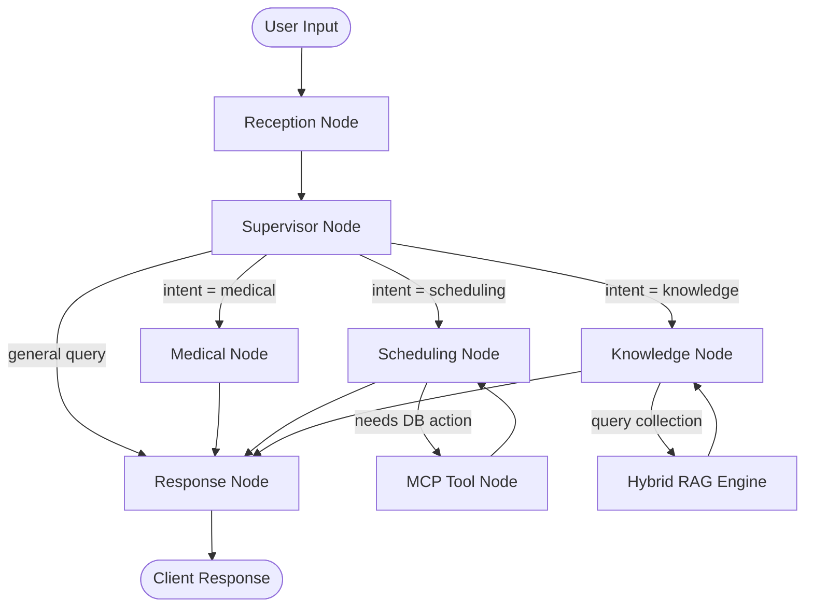

# 🏥 MediAI — Autonomous Multi-Agent Clinic & Hospital Management Platform

<p align="center">
  
  
  
  
  
  
  
  
  
</p>

---

## 📌 Table of Contents

- [Overview](#-overview)
- [System Architecture](#-system-architecture)
- [Key Features](#-key-features)
- [AI Multi-Agent & RAG Engine](#-ai-multi-agent--rag-engine)
- [Tech Stack](#-tech-stack)
- [Directory Structure](#-directory-structure)
- [Getting Started](#-getting-started)
  - [Prerequisites](#prerequisites)
  - [Quick Start (PowerShell / Windows)](#quick-start-powershell)
  - [Option A: Full Docker Deployment](#option-a-full-docker-deployment-recommended)
  - [Option B: Local Development Setup](#option-b-local-development-setup)
- [Default Seed Accounts & Demo Credentials](#-default-seed-accounts--demo-credentials)
- [API Reference](#-api-reference)
- [Docker & Production Deployment](#-docker--production-deployment)
- [Monitoring & Observability](#-monitoring--observability)
- [Testing & Code Quality](#-testing--code-quality)
- [Environment Variables](#-environment-variables)
- [Contributing & Development Workflow](#-contributing--development-workflow)
- [License & Terms of Use](#-license--terms-of-use)

---

## 🌟 Overview

**MediAI** is an enterprise-grade, full-stack healthcare operations and clinical intelligence platform. Built with modern microservice-ready patterns, it unites **multi-agent AI orchestration**, **hybrid medical document retrieval (RAG)**, and **real-time clinic management** into a cohesive, high-performance ecosystem.

MediAI bridges clinical workflows and patient care:
- **Intelligent Triage & Scheduling**: Autonomous LangGraph multi-agent system managing patient onboarding, clinical inquiries, triage routing, and appointment lifecycle.
- **Hybrid RAG Knowledge System**: Fusion of dense vector embeddings (Qdrant) and sparse BM25 retrieval with Cross-Encoder reranking for verified clinical document discovery.
- **Role-Centric Portals**: Dedicated, responsive experiences for **Administrators**, **Doctors**, and **Patients** built on Next.js 15 App Router.
- **Real-Time Event Engine**: Live WebSocket channels delivering instant appointment updates, queue status changes, and background reminder alerts.
- **Full Observability**: Production monitoring with Prometheus metrics and pre-configured Grafana telemetry dashboards.

---

## 🏗️ System Architecture

```
                                  ┌─────────────────────────────────────────┐
                                  │      Next.js 15 Frontend (App Router)   │
                                  │   (Patient, Doctor & Admin Portals)     │
                                  └────────────────────┬────────────────────┘
                                                       │  REST / WebSocket
                                                       ▼
┌───────────────────────────────────────────────────────────────────────────────────────────────────────────┐
│                                       FastAPI Backend Platform                                            │
│                                                                                                           │
│   ┌───────────────────────────┐     ┌──────────────────────────┐     ┌────────────────────────────────┐   │
│   │ Security & Middleware     │     │ Domain Services (MedAI)  │     │ Real-time Event Bus            │   │
│   │ - JWT Auth & RBAC         │     │ - Patients & Doctors     │     │ - WebSocket Manager            │   │
│   │ - Rate Limiting & CORS    │     │ - Appointments & Audits  │     │ - Automated Reminder Scheduler │   │
│   └─────────────┬─────────────┘     └────────────┬─────────────┘     └────────────────────────────────┘   │
│                 │                                │                                                        │
│                 ▼                                ▼                                                        │
│   ┌───────────────────────────────────────────────────────────────────────────────────────────────────┐   │
│   │                                LangGraph Multi-Agent Orchestrator                                 │   │
│   │                                                                                                   │   │
│   │   [Reception Agent]  ──►  [Supervisor Agent]  ──┬──► [Medical / Triage Agent]                     │   │
│   │                                                 ├──► [Scheduling Agent (MCP Tools)]               │   │
│   │                                                 └──► [Knowledge Agent (Hybrid RAG)]               │   │
│   └───────────────────────────────────────────────────────────────────────────────────────────────────┘   │
└──────────────────┬───────────────────────────────┬───────────────────────────────┬────────────────────────┘
                   │                               │                               │
                   ▼                               ▼                               ▼
       ┌───────────────────────┐       ┌───────────────────────┐       ┌───────────────────────┐
       │      PostgreSQL       │       │        Redis 7        │       │        Qdrant         │
       │ (Async SQLAlchemy 2)  │       │ (Cache, Rate Limit,   │       │  (Dense Vector Index  │
       │ Relational Store      │       │  Session Blacklist)   │       │   for Clinical RAG)   │
       └───────────────────────┘       └───────────────────────┘       └───────────────────────┘
```

---

## ✨ Key Features

### 1. 🤖 LangGraph Multi-Agent System
- **Supervisor Agent**: Parses user intent and intelligently coordinates specialized sub-agents.
- **Reception Agent**: Welcomes patients, gathers preliminary details, and establishes session context.
- **Medical & Triage Agent**: Assesses reported symptoms, performs risk scoring, and recommends appropriate clinical steps.
- **Scheduling Agent**: Integrates with FastMCP database tools to query doctor availability, book appointments, reschedule, and handle cancellations in real time.
- **Knowledge Agent**: Connects to the RAG pipeline to answer patient and practitioner queries from authoritative clinic guidelines.

### 2. 📚 Advanced Hybrid RAG Engine
- **Dense Vector Search**: Powered by Qdrant with Google Gemini `text-embedding-001` or SentenceTransformers.
- **Sparse Lexical Search**: Rank-BM25 keyword retrieval for precise medical terminology and nomenclature.
- **Reciprocal Rank Fusion (RRF)**: Merges sparse and dense search results for balanced recall and precision.
- **Cross-Encoder Reranker**: Post-processes candidate chunks to prioritize the most semantically relevant clinical evidence.
- **Document Ingestion**: Automated ingestion and chunking for PDF, DOCX, and text guidelines.

### 3. 👥 Multi-Role Portals (Next.js 15)
- **Patient Portal**: Self-service appointment booking, upcoming schedule overview, past medical history, and 24/7 AI health assistant.
- **Doctor Portal**: Daily schedule timeline, patient consultation details, appointment status management (Confirmed, Completed, Cancelled).
- **Admin Dashboard**: System-wide analytics, doctor & patient directory administration, real-time platform metrics, and system audit logs.

### 4. ⚡ Real-Time WebSockets & Background Jobs
- **Live WebSocket Feed**: Bi-directional updates on `/api/v1/medai/ws/appointments` for instant UI synchronization across tabs and roles.
- **Automated Reminder Scheduler**: Async background worker sending proactive notifications for upcoming appointments.

### 5. 🛡️ Security & Enterprise Standards
- **Token-Based Authentication**: Access & Refresh JWT tokens with bcrypt password hashing and token invalidation.
- **Role-Based Access Control (RBAC)**: Strict permission boundaries enforcing `admin`, `doctor`, and `patient` access policies.
- **Hardened HTTP Stack**: Security headers (HSTS, CSP, XSS-Protection, Frame Options), IP-based rate limiting, and CORS protection.

---

## 🧠 AI Multi-Agent & RAG Engine

### Agent Graph Flow



### Model Routing & Resilience
MediAI uses **LiteLLM Router** with automatic fallback handling:
- **Primary LLM**: Google gemini-3.6-flash (`gemini/gemini-3.6-flash`)
- **Fallback LLM**: Groq / Llama 3.3 70B Versatile (`groq/openai/gpt-oss-120b`)
- **Embeddings**: Gemini `text-embedding-001` 

---

## 💻 Tech Stack

| Layer | Technology | Purpose |
|---|---|---|
| **Frontend Framework** | Next.js 15 (App Router), React 19, TypeScript | Server and client rendered interactive portals |
| **Styling & UI** | Tailwind CSS, Framer Motion, Lucide Icons | Responsive modern design system with glassmorphic accents |
| **State & Forms** | Zustand, React Hook Form, Zod | Global application state and validated client forms |
| **Backend API** | FastAPI, Python 3.11+, Uvicorn | High-throughput async REST and WebSocket server |
| **AI & Orchestration** | LangGraph, LangChain, LiteLLM, FastMCP | Multi-agent state machines, intent routing, and tool calling |
| **Vector Database** | Qdrant | Dense vector search and document index |
| **Relational Database** | PostgreSQL 16 (Async SQLAlchemy 2.0, Alembic) | ACID-compliant transactional persistence |
| **Cache & Sessions** | Redis 7 (Alpine) | Session storage, token blacklist, rate limit sliding windows |
| **Observability** | Prometheus, Grafana, Structlog, LangSmith | Real-time metric aggregation, system dashboards, and LLM tracing |
| **Testing & Quality** | Pytest, Vitest, Playwright, Ruff, Mypy | Full-suite unit, integration, E2E, and static analysis |

---

## 📁 Directory Structure

```
medai/
├── apps/
│   ├── api/                     # FastAPI application factory, lifespan, routes & middleware
│   └── frontend/                # Next.js 15 frontend application
│       ├── src/app/
│       │   ├── (auth)/          # Authentication pages (Login, Register)
│       │   ├── (dashboard)/     # Role-based dashboards (Admin, Doctor, Patient, AI Chat)
│       │   ├── layout.tsx       # Global root layout and providers
│       │   └── globals.css      # Core design tokens and styles
│       └── package.json
├── core/                        # Platform Core & Shared Infrastructure
│   ├── ai/                      # AI Layer: LangGraph multi-agent graph, LiteLLM client, RAG pipeline
│   │   ├── graph/               # Graph builder, nodes, edges, state & FastMCP tools
│   │   ├── llm/                 # LiteLLM router & provider fallbacks
│   │   └── rag/                 # Ingestion, BM25, Qdrant retrieval, RRF fusion & reranker
│   ├── auth/                    # JWT encoding/decoding, password hashing, OAuth2 dependencies
│   ├── config/                  # Pydantic Settings, environment configurations & structured logging
│   ├── database/                # Async SQLAlchemy engine, session factory, Redis & Qdrant clients
│   ├── metrics.py               # Prometheus metrics instrumentation
│   ├── middleware/              # Security headers & rate limiter middlewares
│   └── models/                  # Base models, User, and Audit Log SQLAlchemy models
├── domains/
│   └── medai/                   # MedAI Clinic Management Domain
│       ├── api/v1/              # Domain endpoints (Patients, Doctors, Appointments, Chat, RAG, Admin)
│       ├── models/              # Patient, Doctor, Appointment, and ChatHistory models
│       ├── repositories/        # Async database repositories
│       ├── services/            # Business logic and automated reminder scheduler
│       ├── websockets/          # WebSocket connection manager and real-time event router
│       └── registry.py          # Domain registration entrypoint
├── docker/                      # Custom Dockerfiles and database initialization scripts
├── monitoring/
│   ├── prometheus/              # Prometheus scrapers and alert configs
│   └── grafana/                 # Provisioned Grafana datasources and prebuilt dashboards
├── tests/                       # Automated test suites
│   ├── unit/                    # Unit tests for services, auth, tools, and routers
│   ├── integration/             # Integration tests for database and API endpoints
│   └── e2e/                     # End-to-end tests
├── docker-compose.yml           # Multi-service container definitions
├── Makefile                     # Developer command runner
├── pyproject.toml               # Python dependencies and tool configs
└── seed_admin.py                # Initial database seed script (Admin, Doctor, Patient)
```

---

##  Getting Started

### Prerequisites
Make sure the following tools are installed on your workstation:
- **Python**: `3.11` or higher
- **Node.js**: `20.x` or higher (with `npm`)
- **Docker** & **Docker Compose**
- **uv** (recommended) or `pip`

---

### Quick Start (PowerShell / Windows)

If you are on Windows, you can run the automated startup script:

```powershell
# 1. Run the one-click startup script (activates .venv, starts backing Docker services, and launches uvicorn)
.\start.ps1
```

---

### Step-by-Step Setup

#### 1. Clone the Repository & Configure Environment
```bash
git clone https://github.com/your-org/medai.git
cd medai

# Copy template configuration
cp .env.example .env

# Edit .env and supply your Gemini API key (and optionally Groq / LangSmith keys)
# Windows PowerShell:
# Copy-Item .env.example .env
```

---

#### Option A: Full Docker Deployment (Recommended)
Run the entire platform (FastAPI, PostgreSQL, Redis, Qdrant, Prometheus, Grafana) inside Docker:

```bash
# Build and launch all containerized services in the background
docker compose up -d --build

# Verify all services are healthy and running
docker compose ps

# Seed initial system accounts (Admin, Doctor, Patient) inside the container
docker compose exec api python seed_admin.py
```

- **API Server & Swagger**: [http://localhost:8000/docs](http://localhost:8000/docs)
- **Start Frontend**:
  ```bash
  cd apps/frontend && npm install && npm run dev
  ```
- **Web Application**: [http://localhost:3000](http://localhost:3000)

---

#### Option B: Local Development Setup
Run PostgreSQL, Redis, and Qdrant in Docker, but run FastAPI directly on your host machine with hot-reload:

```bash
# 1. Start ONLY backing infrastructure services (leaves port 8000 open for local FastAPI)
docker compose up -d postgres redis qdrant prometheus grafana

# 2. Setup Python virtual environment & dependencies
python -m venv .venv
source .venv/bin/activate       # On Windows: .venv\Scripts\Activate.ps1

pip install uv
uv sync --all-extras

# 3. Apply database migrations & seed initial accounts
alembic upgrade head
python seed_admin.py

# 4. Start FastAPI server with hot-reload
uvicorn apps.api.main:app --host 0.0.0.0 --port 8000 --reload
```

In a separate terminal, start the Next.js frontend:
```bash
cd apps/frontend
npm install
npm run dev
```
- **Web Application**: [http://localhost:3000](http://localhost:3000)
- **Interactive Swagger Docs**: [http://localhost:8000/docs](http://localhost:8000/docs)

---

##  Default Seed Accounts & Demo Credentials

When you run `python seed_admin.py`, the following demo accounts are created:

| Role | Email | Password | Access / Portal Capabilities |
|---|---|---|---|
|  **System Admin** | `admin@gmail.com` | `Admin@123` | Full administrative control, system metrics, user management, audit logs |
|  **Doctor** | `doctor@gmail.com` | `Doctor123!` | Doctor dashboard, schedule manager, patient consultation records |
|  **Patient** | `patient@gmail.com` | `Patient123!` | Appointment booking, medical timeline, 24/7 AI triage chatbot |

---


### 🔐 Authentication (`/api/v1/auth`)
| Method | Endpoint | Description | Auth Required |
|---|---|---|---|
| `POST` | `/api/v1/auth/register` | Register a new user account | No |
| `POST` | `/api/v1/auth/login` | Authenticate and obtain JWT access & refresh tokens | No |
| `POST` | `/api/v1/auth/refresh` | Refresh an expired access token | Yes (Refresh Token) |
| `POST` | `/api/v1/auth/logout` | Revoke active token & blacklist session in Redis | Yes (Bearer Token) |
| `GET` | `/api/v1/auth/me` | Retrieve currently authenticated user profile | Yes (Bearer Token) |
| `POST` | `/api/v1/auth/password-reset/request` | Submit password reset request for Admin review | No |
| `GET` | `/api/v1/auth/password-reset/pending` | List pending password reset requests | Admin |
| `POST` | `/api/v1/auth/password-reset/approve` | Approve reset request & set temporary password | Admin |

### 🏥 Clinic Management (`/api/v1/medai`)
| Method | Endpoint | Description | Roles |
|---|---|---|---|
| `GET` / `POST` | `/api/v1/medai/patients` | List patients / Register a patient | Admin, Doctor |
| `GET` / `PATCH` / `DELETE` | `/api/v1/medai/patients/{id}` | Manage specific patient record | Admin, Doctor |
| `GET` / `POST` | `/api/v1/medai/doctors` | List doctors / Add a doctor | All (List) / Admin |
| `GET` / `PATCH` / `DELETE` | `/api/v1/medai/doctors/{id}` | Manage doctor profile & availability | Admin, Doctor |
| `GET` / `POST` | `/api/v1/medai/appointments` | Query appointments / Book appointment | Patient, Doctor, Admin |
| `GET` / `PATCH` / `DELETE` | `/api/v1/medai/appointments/{id}` | View / Reschedule / Cancel appointment | Patient, Doctor, Admin |
| `GET` | `/api/v1/medai/doctor-dashboard/summary`| Doctor metrics, today's schedule & stats | Doctor |
| `GET` | `/api/v1/medai/admin/stats` | System analytics and clinic overview | Admin |
| `POST` | `/api/v1/medai/uploads/image` | Upload doctor profile images and clinical media | Admin, Doctor |

### 🤖 AI, RAG & Real-Time
| Method | Endpoint | Description | Details |
|---|---|---|---|
| `POST` | `/api/v1/medai/chat` | Chat with the Multi-Agent Assistant | LangGraph state graph routing |
| `POST` | `/api/v1/medai/rag/upload` | Upload clinical documents (PDF, DOCX) | Chunked and embedded into Qdrant |
| `POST` | `/api/v1/medai/rag/search` | Execute hybrid semantic & lexical search | BM25 + Qdrant + RRF Reranking |
| `WS` | `/api/v1/medai/ws/appointments` | Live WebSocket channel for appointment events | Token-authenticated connection |

### 🩺 Health & Observability
| Method | Endpoint | Description |
|---|---|---|
| `GET` | `/api/v1/health` | Comprehensive health check (PostgreSQL, Redis, Qdrant status) |
| `GET` | `/api/v1/health/live` | Container liveness probe (HTTP 200) |
| `GET` | `/api/v1/health/ready` | Container readiness probe (checks DB connectivity) |
| `GET` | `/metrics` | Prometheus metrics scrape endpoint |

---

## 🐳 Docker & Production Deployment

MediAI features a hardened, multi-stage, non-root production Docker configuration:

### Production Container Build
```bash
# Build the production image with all system dependencies and non-root user
docker build -t medai-api:latest .

# Run container with production environment variables
docker run -d -p 8000:8000 \
  --env-file .env \
  --name medai_api \
  medai-api:latest
```

### Key Container Architecture
- **Multi-Stage Build**: Compiles wheel dependencies in a dedicated build stage and copies site-packages into a lean `python:3.11-slim-bookworm` runtime image.
- **Least-Privilege Security**: Runs as an unprivileged system user `appuser` (`UID 10001`, `GID 10001`).
- **Pre-Configured Storage Mounts**: Pre-creates `/app/uploads` and `/app/data/indexes` with non-root ownership for zero-permission-error volume mounting.
- **Automated Migrations**: `entrypoint.sh` executes database migrations (`alembic upgrade head`) before spawning the multi-worker Uvicorn application server.
- **Native Healthcheck**: Built-in container `HEALTHCHECK` probing `GET /api/v1/health/live`.

### Cloud Deployment (GCP / AWS / Azure)
- **GCP Compute Engine / AWS EC2**: Run `docker compose up -d` on an Ubuntu VM with persistent SSD volumes.
- **Google Cloud Run**: Dynamic port binding via `${PORT:-8000}`. Mount a Google Cloud Storage (GCS) bucket to `/app/uploads` for persistent doctor profile images and clinical media, connecting to Google Cloud SQL and Memorystore Redis.

---

## 📊 Monitoring & Observability

MediAI provides out-of-the-box telemetry and monitoring infrastructure:

```
┌─────────────────────────────────────────────────────────────┐
│                       Access Points                         │
├────────────────────────┬────────────────────────────────────┤
│ Prometheus             │ http://localhost:9090              │
│ Grafana                │ http://localhost:3001              │
│ Grafana Default Login  │ User: admin | Password: medai_admin│
└────────────────────────┴────────────────────────────────────┘
```

### Pre-configured Grafana Dashboards
- **MedAI Overview Dashboard**: Monitors HTTP request rates, latency (p50, p95, p99), error rates (4xx/5xx), active WebSocket connections, database connection pools, and AI token utilization.
- **LangSmith Tracing**: Set `LANGCHAIN_TRACING_V2=true` and provide `LANGCHAIN_API_KEY` to visualize multi-agent graph runs, node transitions, and tool calls in the LangSmith Cloud console.

---

##  Testing & Code Quality

MediAI maintains rigorous automated testing and static analysis standards.

### Backend Testing (Pytest)
```bash
# Run entire test suite with coverage report
make test

# Run unit tests only
make test-unit

# Run specific test modules
pytest tests/integration/test_auth_endpoints.py -v
pytest tests/test_retrieval.py -v
```

### Frontend Testing
```bash
cd apps/frontend

# Run unit and component tests (Vitest)
npm run test

# Run test coverage
npm run test:coverage

# Run End-to-End tests (Playwright)
npm run test:e2e
```

### Code Formatting & Type Checking
```bash
# Format Python code with Ruff
make format

# Lint Python codebase
make lint

# Run strict Mypy typechecks
make typecheck

# Frontend TypeScript and ESLint checks
cd apps/frontend && npm run lint && npm run type-check
```

---

## ⚙️ Environment Variables

Key environment variables configurable in `.env`:

| Category | Variable | Default | Description |
|---|---|---|---|
| **App** | `ENVIRONMENT` | `development` | Deployment environment (`development`, `staging`, `production`) |
| **App** | `API_PORT` | `8000` | FastAPI server port |
| **App** | `ALLOWED_ORIGINS` | `http://localhost:3000,...` | CORS allowed origins (Array or JSON list) |
| **Database** | `DATABASE_URL` | `postgresql+asyncpg://...` | Async PostgreSQL connection string |
| **Cache** | `REDIS_URL` | `redis://localhost:6379/0` | Redis connection URL |
| **Vector DB** | `QDRANT_HOST` / `QDRANT_PORT` | `localhost` / `6333` | Qdrant host and HTTP port |
| **Security** | `JWT_SECRET_KEY` | *(Secret)* | Secret key used for signing JWT access and refresh tokens |
| **Security** | `JWT_ACCESS_TOKEN_EXPIRE_MINUTES` | `30` | Access token lifespan in minutes |
| **Admin Bootstrap** | `ADMIN_EMAIL` / `ADMIN_PASSWORD` | *(Optional)* | Initial Admin credentials created via `scripts.create_admin` |
| **Email / SMTP** | `SMTP_HOST` / `SMTP_PORT` | *(Empty)* / `587` | SMTP server host and TLS port |
| **Email / SMTP** | `EMAILS_ENABLED` | `false` | Enable/disable background appointment reminder emails |
| **AI Models** | `GEMINI_API_KEY` | *(Required)* | Google AI Gemini API Key |
| **AI Models** | `MODEL_SUPERVISOR` | `gemini/gemini-3.6-flash` | Primary supervisor routing model |
| **AI Fallback** | `GROQ_API_KEY` | *(Optional)* | Groq API Key for secondary fallback routing |
| **RAG** | `RAG_CHUNK_SIZE` / `OVERLAP` | `512` / `64` | Token chunk size and sliding overlap for document ingestion |
| **RAG** | `RAG_TOP_K` | `5` | Top candidate chunks retrieved per search query |
| **RAG** | `RAG_SCORE_THRESHOLD` | `0.35` | Minimum cosine relevance score threshold |
| **RAG** | `RAG_ENABLE_RERANKER` | `false` | Enable Cross-Encoder post-retrieval reranking |
| **Booking Limits** | `MAX_BOOKINGS_PER_SLOT` | `2` | Maximum concurrent patient bookings allowed per 30-min slot |
| **Booking Limits** | `MAX_ACTIVE_APPOINTMENTS_PER_PATIENT`| `2` | Maximum active upcoming bookings per individual patient |
| **Agent State** | `LANGGRAPH_CHECKPOINT_BACKEND` | `memory` | LangGraph checkpointer backend (`memory` or `redis`) |
| **Tracing** | `LANGCHAIN_TRACING_V2` | `false` | Enable LangSmith tracing |

---

## 🤝 Contributing & Development Workflow

1. **Fork the repository** and create a feature branch:
   ```bash
   git checkout -b feature/amazing-feature
   ```
2. **Commit your changes** following conventional commit standards:
   ```bash
   git commit -m "feat(ai): add multi-modal triage analysis node"
   ```
3. **Ensure all checks pass**:
   ```bash
   make check
   make test
   ```
4. **Open a Pull Request** against the `main` branch.

---

## 📄 License & Terms of Use

Copyright (c) 2026 MediAI Contributors & Authors. All Rights Reserved.

This project is licensed under a **Source-Available (View & Contribute Only)** model:
- ✅ **Viewing & Evaluating**: You are welcome to view, study, and test the source code.
- ✅ **Contributing**: You are welcome to submit issues, discussions, and pull requests directly to this repository.
- ❌ **No External Reuse / Redistribution**: You **may not** copy, replicate, modify, or reuse this codebase (or any portion of it) in other commercial or open-source projects, products, or repositories without explicit prior written permission from the copyright holders.

For complete terms and conditions, please refer to the [LICENSE](LICENSE) file.

<p align="center">
  <sub>Built with ❤️ by the MediAI Engineering Team. Empowering clinicians and patients through intelligent automation.</sub>
</p>
