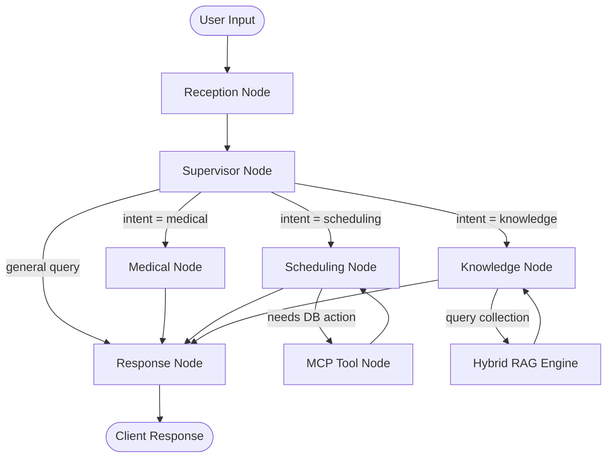

# 🏥 MediAI — Autonomous Multi-Agent Clinic & Hospital Management Platform

<p align="center">
  
  
  
  
  
  
  
  
  
</p>

---

## 📌 Table of Contents

- [Overview](#-overview)
- [System Architecture](#️-system-architecture)
- [Key Features](#-key-features)
- [AI Multi-Agent & RAG Engine](#-ai-multi-agent--rag-engine)
- [Tech Stack](#-tech-stack)
- [Directory Structure](#-directory-structure)
- [Getting Started](#-getting-started)
  - [Prerequisites](#prerequisites)
  - [Option A: Local Development (Recommended)](#option-a-local-development-recommended)
  - [Option B: Production Docker Deployment](#option-b-production-docker-deployment)
- [Default Seed Accounts & Demo Credentials](#-default-seed-accounts--demo-credentials)
- [API Reference](#-api-reference)
- [Monitoring & Observability](#-monitoring--observability)
- [Testing & Code Quality](#-testing--code-quality)
- [Environment Variables](#️-environment-variables)
- [Contributing & Development Workflow](#-contributing--development-workflow)
- [License & Terms of Use](#-license--terms-of-use)

---

## 🌟 Overview

**MediAI** is an enterprise-grade, full-stack healthcare operations and clinical intelligence platform. Built with modern microservice-ready patterns, it unites **multi-agent AI orchestration**, **hybrid medical document retrieval (RAG)**, and **real-time clinic management** into a cohesive, high-performance ecosystem.

MediAI bridges clinical workflows and patient care through:

- **Intelligent Triage & Scheduling** — Autonomous LangGraph multi-agent system managing patient onboarding, clinical inquiries, triage routing, and appointment lifecycle.
- **Hybrid RAG Knowledge System** — Fusion of dense vector embeddings (Qdrant) and sparse BM25 retrieval with Cross-Encoder reranking for verified clinical document discovery.
- **Role-Centric Portals** — Dedicated, responsive experiences for **Administrators**, **Doctors**, and **Patients** built on Next.js 15 App Router.
- **Real-Time Event Engine** — Live WebSocket channels delivering instant appointment updates, queue status changes, and background reminder alerts.
- **Full Observability** — Production monitoring with Prometheus metrics and pre-configured Grafana telemetry dashboards.

---

## 🏗️ System Architecture

```
                                  ┌─────────────────────────────────────────┐
                                  │      Next.js 15 Frontend (App Router)   │
                                  │   (Patient, Doctor & Admin Portals)     │
                                  └────────────────────┬────────────────────┘
                                                       │  REST / WebSocket
                                                       ▼
┌─────────────────────────────────────────────────────────────────────────────────────────────┐
│                                     FastAPI Backend Platform                                │
│                                                                                             │
│  ┌──────────────────────────┐   ┌──────────────────────────┐   ┌────────────────────────┐  │
│  │  Security & Middleware   │   │  Domain Services (MedAI) │   │  Real-time Event Bus   │  │
│  │  - JWT Auth & RBAC       │   │  - Patients & Doctors    │   │  - WebSocket Manager   │  │
│  │  - Rate Limiting & CORS  │   │  - Appointments & Audits │   │  - Reminder Scheduler  │  │
│  └──────────┬───────────────┘   └────────────┬─────────────┘   └────────────────────────┘  │
│             │                                │                                             │
│             ▼                                ▼                                             │
│  ┌──────────────────────────────────────────────────────────────────────────────────────┐  │
│  │                          LangGraph Multi-Agent Orchestrator                          │  │
│  │                                                                                      │  │
│  │   [Reception Agent] ──► [Supervisor Agent] ──┬──► [Medical / Triage Agent]           │  │
│  │                                              ├──► [Scheduling Agent (MCP Tools)]     │  │
│  │                                              └──► [Knowledge Agent (Hybrid RAG)]     │  │
│  └──────────────────────────────────────────────────────────────────────────────────────┘  │
└──────────────────┬─────────────────────────┬──────────────────────────┬────────────────────┘
                   │                         │                          │
                   ▼                         ▼                          ▼
       ┌───────────────────────┐  ┌───────────────────────┐  ┌───────────────────────┐
       │      PostgreSQL       │  │        Redis 7        │  │        Qdrant         │
       │ (Async SQLAlchemy 2)  │  │ (Cache, Rate Limit,   │  │  (Dense Vector Index  │
       │ Relational Store      │  │  Session Blacklist)   │  │   for Clinical RAG)   │
       └───────────────────────┘  └───────────────────────┘  └───────────────────────┘
```

---

## ✨ Key Features

### 1. 🤖 LangGraph Multi-Agent System
- **Supervisor Agent**: Parses user intent and intelligently routes to the correct specialist sub-agent.
- **Reception Agent**: Welcomes patients, gathers preliminary details, classifies intent, and extracts clinical entities.
- **Medical & Triage Agent**: Assesses reported symptoms, performs risk scoring, and recommends appropriate clinical steps using the RAG pipeline.
- **Scheduling Agent**: Uses FastMCP database tools to query doctor availability, book appointments, reschedule, and handle cancellations in real time.
- **Knowledge Agent**: Answers patient and practitioner queries from authoritative clinic guidelines via the RAG pipeline.

### 2. 📚 Advanced Hybrid RAG Engine
- **Dense Vector Search**: Powered by Qdrant with Google Gemini `gemini-embedding-001` embeddings.
- **Sparse Lexical Search**: Rank-BM25 keyword retrieval for precise medical terminology matching.
- **Reciprocal Rank Fusion (RRF)**: Merges sparse and dense results for balanced recall and precision.
- **Cross-Encoder Reranker**: Post-processes candidate chunks to surface the most semantically relevant clinical evidence.
- **Document Ingestion**: Automated chunking and embedding for PDF, DOCX, and plain-text clinical guidelines.

### 3. 👥 Multi-Role Portals (Next.js 15)
- **Patient Portal**: Self-service appointment booking, upcoming schedule overview, past medical history, and 24/7 AI health assistant chat.
- **Doctor Console**: Daily schedule timeline, patient consultation details, appointment status management (Confirmed, Completed, Cancelled), and Clinical AI RAG access.
- **Admin Dashboard**: System-wide analytics, doctor & patient directory administration, master appointment view, real-time platform metrics, and audit trail logs.

### 4. ⚡ Real-Time WebSockets & Background Jobs
- **Live WebSocket Feed**: Bi-directional updates on `/api/v1/medai/ws/appointments` for instant UI synchronization across roles and tabs.
- **Automated Reminder Scheduler**: Async background worker sending proactive notifications for upcoming appointments.
- **Redis Pub/Sub**: Distributed WebSocket synchronization across multi-worker Uvicorn deployments.

### 5. 🛡️ Security & Enterprise Standards
- **Token-Based Authentication**: Access & Refresh JWT tokens with bcrypt password hashing and Redis-backed token blacklisting.
- **Role-Based Access Control (RBAC)**: Strict permission boundaries enforcing `admin`, `doctor`, and `patient` access policies with route-level guards on both frontend and backend.
- **Hardened HTTP Stack**: Security headers (HSTS, CSP, XSS-Protection, X-Frame-Options), IP-based sliding-window rate limiting, and CORS protection.

---

## 🧠 AI Multi-Agent & RAG Engine

### Agent Graph Flow


```mermaid
graph TD
    Start([User Input]) --> Reception[Reception Node]
    Reception --> Supervisor[Supervisor Node]
    Supervisor -->|intent = medical| MedNode[Medical Node]
    Supervisor -->|intent = scheduling| SchedNode[Scheduling Node]
    Supervisor -->|intent = knowledge| KnowNode[Knowledge Node]
    Supervisor -->|general query| RespNode[Response Node]

    SchedNode -->|needs DB action| ToolNode[MCP Tool Node]
    ToolNode --> SchedNode

    KnowNode -->|query collection| RAG[Hybrid RAG Engine]
    RAG --> KnowNode

    MedNode --> RespNode
    SchedNode --> RespNode
    KnowNode --> RespNode
    RespNode --> End([Client Response])
```

### Model Routing & Resilience

MediAI uses **LiteLLM Router** with per-agent primary and automatic fallback handling:

| Agent | Primary Model | Fallback Model |
|---|---|---|
| **Supervisor** | `gemini/gemini-3.6-flash` | `groq/llama-3.3-70b-versatile` |
| **Reception** | `gemini/gemini-3.6-flash` | `groq/llama-3.1-8b-instant` |
| **Medical** | `gemini/gemini-3.6-flash` | `groq/llama-3.3-70b-versatile` |
| **Scheduling** | `gemini/gemini-3.6-flash` | `groq/llama-3.1-8b-instant` |
| **Knowledge** | `gemini/gemini-3.6-flash` | `groq/llama-3.3-70b-versatile` |
| **Embeddings** | `gemini-embedding-001` | SentenceTransformers (local fallback) |

### FastMCP Tool Suite

The Scheduling Agent uses **FastMCP** to call database-backed tools directly from the LangGraph:

| Tool | Description |
|---|---|
| `get_available_doctors` | Query doctor availability by specialty and date |
| `book_appointment` | Create a new appointment record |
| `reschedule_appointment` | Update appointment date/time |
| `cancel_appointment` | Cancel and soft-delete an appointment |
| `get_patient_appointments` | Retrieve a patient's appointment history |
| `get_patient_profile` | Fetch patient medical profile for context injection |

---

## 💻 Tech Stack

| Layer | Technology | Purpose |
|---|---|---|
| **Frontend Framework** | Next.js 15 (App Router), React 19, TypeScript | Server and client-rendered interactive portals |
| **Styling & UI** | Tailwind CSS, Framer Motion, Lucide Icons | Responsive modern design with glassmorphic accents |
| **State & Forms** | Zustand, React Hook Form, Zod | Global application state and validated client forms |
| **Backend API** | FastAPI, Python 3.11+, Uvicorn | High-throughput async REST and WebSocket server |
| **AI & Orchestration** | LangGraph, LangChain, LiteLLM, FastMCP | Multi-agent state machines, intent routing, and tool calling |
| **LLM Provider** | Google Gemini (primary), Groq / Llama (fallback) | Natural language understanding and generation |
| **Vector Database** | Qdrant | Dense vector search and clinical document index |
| **Relational Database** | PostgreSQL 16 (Async SQLAlchemy 2.0, Alembic) | ACID-compliant transactional persistence |
| **Cache & Sessions** | Redis 7 (Alpine) | Session storage, JWT blacklist, rate-limit windows, WebSocket pub/sub |
| **Reverse Proxy** | Caddy 2 | Automatic TLS/HTTPS and API routing in production |
| **Observability** | Prometheus, Grafana, Grafana Alloy, Structlog, LangSmith | Metrics, dashboards, and LLM tracing |
| **Testing & Quality** | Pytest, Vitest, Playwright, Ruff, Mypy | Unit, integration, E2E, and static analysis |

---

## 📁 Directory Structure

```
MediAI/
├── apps/
│   ├── api/                          # FastAPI application factory
│   │   ├── main.py                   # App factory: middleware, routers, exception handlers, lifespan
│   │   └── dependencies.py           # Shared FastAPI dependency providers
│   └── frontend/                     # Next.js 15 frontend
│       └── src/
│           ├── app/
│           │   ├── (auth)/           # Login & Register pages
│           │   ├── (dashboard)/      # Role-based dashboards
│           │   │   ├── admin/        # Admin dashboard, doctors, patients, appointments, audit logs
│           │   │   ├── doctor/       # Doctor console & patient roster
│           │   │   ├── patient/      # Patient portal, booking, profile & AI chat
│           │   │   ├── ai-chat/      # Standalone multi-agent AI chat interface
│           │   │   └── layout.tsx    # Shared dashboard layout with role-aware sidebar
│           │   └── globals.css       # Core design tokens & styles
│           ├── components/           # Reusable UI components
│           ├── lib/                  # Auth context, API client, utility functions
│           └── types/                # Shared TypeScript type definitions
│
├── core/                             # Platform Core & Shared Infrastructure
│   ├── ai/
│   │   ├── graph/                    # LangGraph orchestration
│   │   │   ├── agents/               # Reception, Supervisor, Medical, Scheduling, Knowledge agents
│   │   │   ├── nodes.py              # Node functions wiring agents into the graph
│   │   │   ├── edges.py              # Conditional edge routing logic
│   │   │   ├── state.py              # MedAIState TypedDict definition
│   │   │   ├── builder.py            # Graph builder & compilation
│   │   │   └── tools/                # FastMCP tool definitions (appointment, patient, database)
│   │   ├── llm/                      # LiteLLM router, per-agent model config & fallbacks
│   │   ├── rag/                      # Hybrid RAG pipeline
│   │   │   ├── pipeline.py           # Orchestrates ingestion, retrieval, reranking, generation
│   │   │   ├── ingestion/            # PDF/DOCX chunking & embedding
│   │   │   └── retrieval/            # BM25, Qdrant, RRF fusion & Cross-Encoder reranker
│   │   └── conversation/             # Conversation history & memory management
│   ├── auth/                         # JWT, password hashing, OAuth2 dependencies
│   ├── config/                       # Pydantic Settings, env config & structured logging
│   ├── database/                     # Async SQLAlchemy engine, Redis & Qdrant clients
│   ├── metrics.py                    # Prometheus instrumentation
│   ├── middleware/                   # SecurityHeadersMiddleware & RateLimitMiddleware
│   └── models/                       # Base, User & AuditLog SQLAlchemy models
│
├── domains/
│   └── medai/                        # MedAI Clinic Management Domain
│       ├── api/v1/                   # Domain endpoints
│       │   ├── patients.py           # Patient CRUD
│       │   ├── doctors.py            # Doctor management
│       │   ├── appointments.py       # Appointment booking, rescheduling, cancellation
│       │   ├── chat.py               # Multi-agent AI chat endpoint
│       │   ├── rag.py                # RAG document upload & search
│       │   ├── doctor_dashboard.py   # Doctor metrics & schedule
│       │   ├── admin.py              # Admin stats, user management & audit logs
│       │   ├── uploads.py            # Profile image upload
│       │   └── router.py             # Domain router registration
│       ├── models/                   # Patient, Doctor, Appointment & ChatHistory models
│       ├── repositories/             # Async database repositories
│       ├── services/                 # Business logic & reminder scheduler
│       ├── websockets/               # WebSocket connection manager & event router
│       └── registry.py              # Domain registration entrypoint
│
├── monitoring/
│   ├── prometheus/                   # Prometheus scrape configs & alert rules
│   └── grafana/                      # Provisioned Grafana datasources & dashboards
│
├── tests/
│   ├── unit/                         # Unit tests for services, auth, tools & routers
│   ├── integration/                  # Integration tests for DB & API endpoints
│   └── e2e/                          # End-to-end Playwright tests
│
├── Dockerfile                        # Multi-stage production API image
├── docker-compose.yml                # Production deployment (Caddy + Grafana Alloy)
├── docker-compose.local.yml          # Local development (all services incl. Prometheus & Grafana)
├── Caddyfile                         # Caddy reverse proxy config (auto-HTTPS)
├── Makefile                          # Developer command runner
├── pyproject.toml                    # Python dependencies & tool configs
├── alembic.ini                       # Database migration config
├── seed_admin.py                     # Initial DB seed script
├── start-local.ps1                   # Windows PowerShell one-click startup
└── start-local.sh                    # Linux/macOS one-click startup
```

---

## 🚀 Getting Started

### Prerequisites

| Tool | Version | Notes |
|---|---|---|
| **Python** | `3.11+` | Required for backend |
| **Node.js** | `20.x+` | Required for frontend |
| **Docker & Docker Compose** | Latest | Required for infrastructure |
| **uv** | Latest | Fast Python package manager (`pip install uv`) |

You will also need:
- **Google Gemini API Key** — [AI Studio](https://aistudio.google.com/app/apikey) *(required)*
- **Groq API Key** — [Groq Console](https://console.groq.com) *(optional — LLM fallback)*
- **LangSmith API Key** — [LangSmith](https://smith.langchain.com) *(optional — LLM trace observability)*

---

### Option A: Local Development (Recommended)

Runs **all services** (FastAPI, PostgreSQL, Redis, Qdrant, Prometheus, Grafana) inside Docker via `docker-compose.local.yml`, with source code hot-reloaded from your host machine.

#### Step 1 — Clone & Configure

```bash
git clone https://github.com/akshayy201/MediAI.git
cd MediAI
```

```powershell
# Windows PowerShell
Copy-Item .env.local.example .env.local
notepad .env.local   # Fill in GEMINI_API_KEY (and optionally GROQ_API_KEY)
```

```bash
# Linux / macOS
cp .env.local.example .env.local
nano .env.local   # Fill in GEMINI_API_KEY
```

#### Step 2 — Start the Full Local Stack

**Windows (one-click):**
```powershell
.\start-local.ps1
```

**Linux / macOS (one-click):**
```bash
chmod +x start-local.sh && ./start-local.sh
```

**Manual (all platforms):**
```bash
docker compose -f docker-compose.local.yml up -d --build

# Verify all services are healthy
docker compose -f docker-compose.local.yml ps
```

#### Step 3 — Seed Initial Accounts

```bash
docker compose -f docker-compose.local.yml exec api python seed_admin.py
```

#### Step 4 — Start the Frontend

```bash
cd apps/frontend
npm install
npm run dev
```

#### Local Service Access Points

| Service | URL |
|---|---|
| **Frontend** | http://localhost:3000 |
| **API Server** | http://localhost:8000 |
| **Swagger Docs** | http://localhost:8000/docs |
| **ReDoc** | http://localhost:8000/redoc |
| **Qdrant Dashboard** | http://localhost:6333/dashboard |
| **Prometheus** | http://localhost:9090 |
| **Grafana** | http://localhost:3001 |

> **Note**: PostgreSQL is exposed on host port `5433` (mapped from container port `5432`) to avoid conflicts with a locally installed PostgreSQL.

#### Useful Commands

```bash
# Tail all service logs
docker compose -f docker-compose.local.yml logs -f

# Tail API logs only
docker compose -f docker-compose.local.yml logs -f api

# Rebuild after backend changes
docker compose -f docker-compose.local.yml up -d --build api

# Stop everything
docker compose -f docker-compose.local.yml down
```

> Run `make help` to see all available Makefile shortcuts.

---

### Option B: Production Docker Deployment

The production `docker-compose.yml` is a lightweight, hardened stack designed for a server/VM with a public domain. It uses:

- **FastAPI API** — pulled from pre-built image `akshayy201/medai-api:latest`
- **PostgreSQL** — patched Alpine image (`akshayy201/medai-postgres:16-alpine-patched`)
- **Redis** — with persistence and memory limits
- **Caddy** — automatic TLS/HTTPS reverse proxy
- **Grafana Alloy** — forwards `/metrics` to Grafana Cloud

> **Note**: The production stack does **not** bundle Qdrant (use Qdrant Cloud), or local Prometheus/Grafana (metrics are forwarded to Grafana Cloud).

#### Step 1 — Configure

```bash
git clone https://github.com/akshayy201/MediAI.git
cd MediAI
cp .env.example .env
nano .env   # Fill in all secrets, passwords & API keys
```

Update `Caddyfile` with your actual domain:
```
your-domain.com {
    reverse_proxy api:8000
}
```

#### Step 2 — Deploy

```bash
docker compose up -d

# Check service health
docker compose ps

# Seed initial accounts
docker compose exec api python seed_admin.py
```

#### Key Container Architecture

- **Multi-Stage Build**: Wheel dependencies compiled in a build stage; only site-packages copied to the lean `python:3.11-slim-bookworm` runtime.
- **Least-Privilege Security**: Runs as `appuser` (UID 10001 / GID 10001).
- **Automated Migrations**: Entrypoint runs `alembic upgrade head` before starting Uvicorn.
- **Native Healthcheck**: Container probes `GET /api/v1/health/live`.

---

## 🔑 Default Seed Accounts & Demo Credentials

After running `python seed_admin.py`:

| Role | Email | Password | Portal Access |
|---|---|---|---|
| 🔴 **System Admin** | `admin@gmail.com` | `Admin@123` | Full admin control, analytics, user management, audit logs |
| 🟢 **Doctor** | `doctor@gmail.com` | `Doctor123!` | Doctor console, patient roster, schedule manager, Clinical AI RAG |
| 🔵 **Patient** | `patient@gmail.com` | `Patient123!` | Appointment booking, medical profile, AI triage chatbot |

> ⚠️ **Change all default passwords immediately in any non-demo environment.**

---

## 📡 API Reference

### 🔐 Authentication (`/api/v1/auth`)

| Method | Endpoint | Description | Auth Required |
|---|---|---|---|
| `POST` | `/api/v1/auth/register` | Register a new user account | No |
| `POST` | `/api/v1/auth/login` | Authenticate & obtain JWT access + refresh tokens | No |
| `POST` | `/api/v1/auth/refresh` | Exchange refresh token for a new access token | Yes (Refresh Token) |
| `POST` | `/api/v1/auth/logout` | Revoke token & blacklist session in Redis | Yes (Bearer Token) |
| `GET` | `/api/v1/auth/me` | Retrieve current user profile | Yes (Bearer Token) |
| `POST` | `/api/v1/auth/password-reset/request` | Submit password reset request | No |
| `GET` | `/api/v1/auth/password-reset/pending` | List pending reset requests | Admin only |
| `POST` | `/api/v1/auth/password-reset/approve` | Approve reset & set temporary password | Admin only |

### 🏥 Clinic Management (`/api/v1/medai`)

| Method | Endpoint | Description | Roles |
|---|---|---|---|
| `GET` / `POST` | `/api/v1/medai/patients` | List patients / Register patient profile | Admin, Doctor |
| `GET` / `PATCH` / `DELETE` | `/api/v1/medai/patients/{id}` | Manage specific patient record | Admin, Doctor |
| `GET` / `POST` | `/api/v1/medai/doctors` | List doctors / Add a doctor | All (List) / Admin (Create) |
| `GET` / `PATCH` / `DELETE` | `/api/v1/medai/doctors/{id}` | Manage doctor profile & availability | Admin, Doctor |
| `GET` / `POST` | `/api/v1/medai/appointments` | Query / Book an appointment | Patient, Doctor, Admin |
| `GET` / `PATCH` / `DELETE` | `/api/v1/medai/appointments/{id}` | View / Reschedule / Cancel appointment | Patient, Doctor, Admin |
| `GET` | `/api/v1/medai/doctor-dashboard/summary` | Doctor metrics, today's schedule & stats | Doctor |
| `GET` | `/api/v1/medai/admin/stats` | System analytics and clinic overview | Admin |
| `POST` | `/api/v1/medai/uploads/image` | Upload doctor profile images | Admin, Doctor |

### 🤖 AI, RAG & Real-Time

| Method | Endpoint | Description | Details |
|---|---|---|---|
| `POST` | `/api/v1/medai/chat` | Chat with the Multi-Agent AI Assistant | LangGraph routing via LiteLLM |
| `POST` | `/api/v1/medai/rag/upload` | Upload clinical documents (PDF, DOCX, TXT) | Chunked & embedded into Qdrant |
| `POST` | `/api/v1/medai/rag/search` | Hybrid semantic & lexical search | BM25 + Qdrant + RRF + optional reranking |
| `WS` | `/api/v1/medai/ws/appointments` | Live WebSocket for appointment events | Token-authenticated, Redis pub/sub |

### 🩺 Health & Observability

| Method | Endpoint | Description |
|---|---|---|
| `GET` | `/api/v1/health` | Full health check (PostgreSQL, Redis, Qdrant status) |
| `GET` | `/api/v1/health/live` | Liveness probe (HTTP 200) |
| `GET` | `/api/v1/health/ready` | Readiness probe (checks DB connectivity) |
| `GET` | `/metrics` | Prometheus metrics scrape endpoint |

> 📖 Interactive docs: **[http://localhost:8000/docs](http://localhost:8000/docs)** (Swagger UI) | **[http://localhost:8000/redoc](http://localhost:8000/redoc)** (ReDoc)

---

## 📊 Monitoring & Observability

### Local Development

When using `docker-compose.local.yml`, Prometheus and Grafana are pre-configured:

| Service | URL | Login |
|---|---|---|
| **Prometheus** | http://localhost:9090 | — |
| **Grafana** | http://localhost:3001 | `admin` / `admin` |

**Pre-configured Dashboard** — MedAI Overview: HTTP request rates, latency (p50/p95/p99), 4xx/5xx error rates, active WebSocket connections, DB pool saturation, AI token usage.

### LangSmith LLM Tracing

Enable end-to-end multi-agent trace visualization:

```env
LANGCHAIN_TRACING_V2=true
LANGCHAIN_API_KEY=your-langsmith-key
LANGCHAIN_PROJECT=mediai
```

---

## 🧪 Testing & Code Quality

### Backend (Pytest)

```bash
make test          # Full suite with coverage
make test-unit     # Unit tests only
pytest tests/integration/test_auth_endpoints.py -v
pytest tests/test_retrieval.py -v
```

### Frontend

```bash
cd apps/frontend
npm run test              # Vitest unit & component tests
npm run test:coverage     # With coverage report
npm run test:e2e          # Playwright E2E tests
npm run test:e2e:ui       # Playwright interactive UI
```

### Code Quality

```bash
make format      # Format Python with Ruff
make lint        # Lint Python codebase
make typecheck   # Strict Mypy type checking
make check       # lint + typecheck combined

cd apps/frontend && npm run lint && npm run type-check
```

---

## ⚙️ Environment Variables

| Category | Variable | Default | Description |
|---|---|---|---|
| **App** | `ENVIRONMENT` | `development` | `development`, `staging`, or `production` |
| **App** | `API_PORT` | `8000` | FastAPI server port |
| **App** | `ALLOWED_ORIGINS` | `http://localhost:3000,...` | CORS allowed origins |
| **Database** | `DATABASE_URL` | `postgresql+asyncpg://...` | Async PostgreSQL connection string |
| **Cache** | `REDIS_URL` | `redis://localhost:6379/0` | Redis connection URL |
| **Vector DB** | `QDRANT_HOST` / `QDRANT_PORT` | `localhost` / `6333` | Qdrant host & HTTP port |
| **Security** | `JWT_SECRET_KEY` | *(required)* | Secret key for signing JWT tokens |
| **Security** | `JWT_ACCESS_TOKEN_EXPIRE_MINUTES` | `30` | Access token lifespan in minutes |
| **Security** | `JWT_REFRESH_TOKEN_EXPIRE_DAYS` | `7` | Refresh token lifespan in days |
| **AI Models** | `GEMINI_API_KEY` | *(required)* | Google AI Gemini API Key |
| **AI Models** | `MODEL_SUPERVISOR` | `gemini/gemini-3.6-flash` | Supervisor routing model |
| **AI Models** | `MODEL_MEDICAL` | `gemini/gemini-3.6-flash` | Medical triage agent model |
| **AI Models** | `MODEL_SCHEDULING` | `gemini/gemini-3.6-flash` | Scheduling agent model |
| **AI Models** | `MODEL_KNOWLEDGE` | `gemini/gemini-3.6-flash` | Knowledge RAG agent model |
| **AI Models** | `MODEL_RECEPTION` | `gemini/gemini-3.6-flash` | Reception/intent classifier model |
| **AI Fallback** | `GROQ_API_KEY` | *(optional)* | Groq API Key for secondary LLM fallback |
| **Embeddings** | `GEMINI_EMBEDDING_MODEL` | `gemini-embedding-001` | Embedding model for Qdrant |
| **LiteLLM** | `LITELLM_NUM_RETRIES` | `2` | Retries before fallback |
| **LiteLLM** | `LITELLM_REQUEST_TIMEOUT` | `30` | LLM request timeout (seconds) |
| **RAG** | `RAG_CHUNK_SIZE` | `512` | Token chunk size for document ingestion |
| **RAG** | `RAG_CHUNK_OVERLAP` | `64` | Sliding overlap between chunks |
| **RAG** | `RAG_TOP_K` | `5` | Top-K candidates retrieved per query |
| **RAG** | `RAG_SCORE_THRESHOLD` | `0.7` | Minimum cosine similarity threshold |
| **Tracing** | `LANGCHAIN_TRACING_V2` | `false` | Enable LangSmith LLM tracing |
| **Tracing** | `LANGCHAIN_API_KEY` | *(optional)* | LangSmith API key |
| **Frontend** | `NEXT_PUBLIC_API_BASE_URL` | `http://localhost:8000` | Backend URL for the Next.js app |

---

## 🤝 Contributing & Development Workflow

1. **Fork the repository** and create a feature branch:
   ```bash
   git checkout -b feature/your-feature-name
   ```
2. **Commit** using conventional commit standards:
   ```bash
   git commit -m "feat(ai): add multi-modal triage analysis node"
   git commit -m "fix(appointments): resolve race condition in slot booking"
   git commit -m "docs: update environment variable reference table"
   ```
3. **Ensure all checks pass** before pushing:
   ```bash
   make check   # lint + typecheck
   make test    # full test suite
   ```
4. **Open a Pull Request** against `main` at [github.com/akshayy201/MediAI](https://github.com/akshayy201/MediAI).

---

## 📄 License & Terms of Use

Copyright (c) 2026 MediAI Contributors & Authors. All Rights Reserved.

This project is licensed under a **Source-Available (View & Contribute Only)** model:

- ✅ **Viewing & Evaluating**: You are welcome to view, study, and test the source code.
- ✅ **Contributing**: You are welcome to submit issues, discussions, and pull requests.
- ❌ **No External Reuse / Redistribution**: You **may not** copy, replicate, modify, or reuse this codebase (or any portion of it) in other projects, products, or repositories without explicit prior written permission from the copyright holders.

For complete terms, please refer to the [LICENSE](LICENSE) file.

<p align="center">
  <sub>Built with ❤️ by <a href="https://github.com/akshayy201">Akshay</a>. Empowering clinicians and patients through intelligent automation.</sub>
</p>
